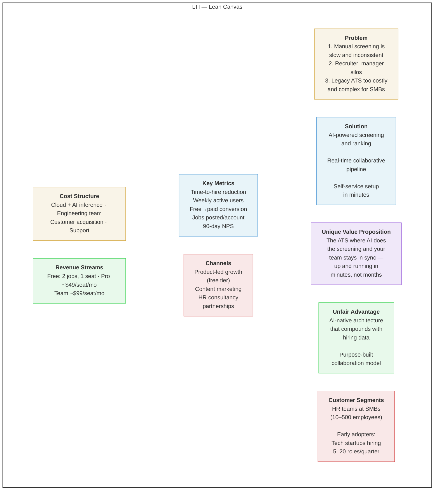
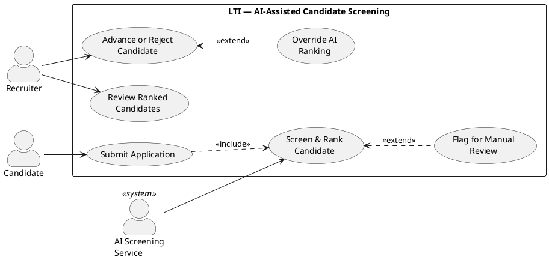
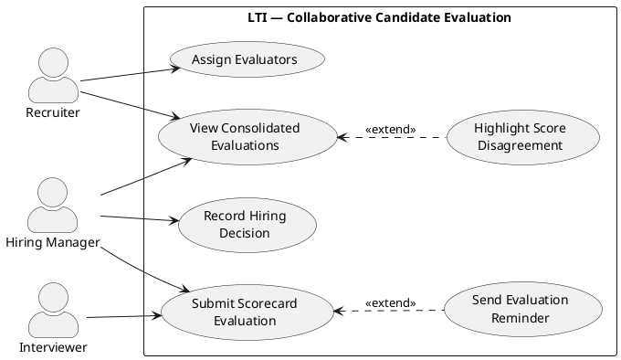
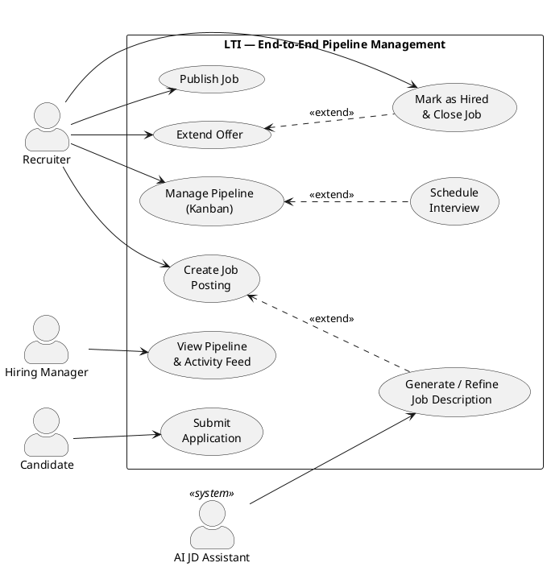
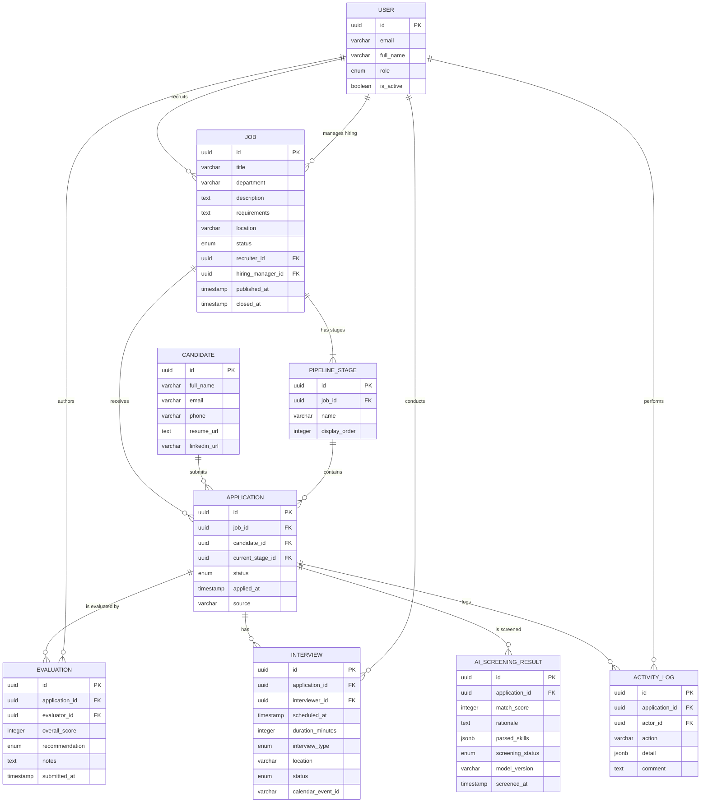
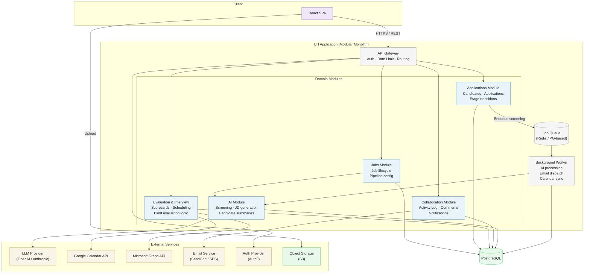

# LTI — AI-Native Applicant Tracking System: Initial Product Documentation

---

## Table of Contents

1. [Introduction](#1-introduction)
2. [LTI Overview](#2-lti-overview)
3. [Value Proposition and Competitive Advantages](#3-value-proposition-and-competitive-advantages)
4. [Main Functions](#4-main-functions)
5. [Lean Canvas](#5-lean-canvas)
6. [Main Use Cases](#6-main-use-cases)
7. [Use Case Diagrams](#7-use-case-diagrams)
8. [Data Model](#8-data-model)
9. [High-Level System Design](#9-high-level-system-design)
10. [C4 Model](#10-c4-model)
11. [Assumptions and Open Questions](#11-assumptions-and-open-questions)
12. [Conclusion](#12-conclusion)

---

## 1. Introduction

This document describes LTI, a startup product in its initial (MVP) phase. It covers the product vision, business model, core use cases, data model, and technical architecture — everything needed to understand what LTI is, why it exists, and how the first version is structured.

The audience for this document is broad: founders, product stakeholders, engineering leads, and anyone evaluating LTI for investment, partnership, or technical review. Each section is self-contained but cross-referenced where relevant.

**Scope:** This document covers the MVP. Features explicitly marked as post-MVP are included only to show the product's expansion path, not as commitments.

**Diagram rendering:** The document includes diagrams in two formats. Mermaid diagrams render natively in GitHub, GitLab, Notion, and most Markdown viewers. PlantUML diagrams (used for UML use cases and C4 models) can be rendered at [plantuml.com/plantuml/uml](https://www.plantuml.com/plantuml/uml), via the VS Code PlantUML extension, or in any JetBrains IDE.

---

## 2. LTI Overview

LTI is an applicant tracking system built from the ground up with AI at its core — not bolted on as an afterthought. It gives lean HR teams and hiring managers a shared workspace to manage the full hiring pipeline: from job posting through offer, with intelligent automation handling the repetitive work that slows recruiters down.

The platform targets small-to-mid-sized companies (10–500 employees) that have outgrown spreadsheets and email threads but find legacy ATS products bloated, expensive, and hostile to actual collaboration between recruiters and hiring managers.

> **In one line:** LTI turns hiring from a fragmented email-and-spreadsheet process into a streamlined, AI-assisted workflow where recruiters and hiring managers actually work in sync.

---

## 3. Value Proposition and Competitive Advantages

### 3.1 Value Proposition

**For recruiters:** Spend less time on administrative overhead — screening, scheduling, status updates — and more time on high-value candidate engagement.

**For hiring managers:** Get real-time visibility into your pipeline without chasing recruiters for updates. Evaluate candidates faster with structured, AI-assisted scorecards.

**For the business:** Reduce time-to-hire and cost-per-hire while building a repeatable, data-informed hiring process from day one.

### 3.2 Core Differentiators

| Advantage | What it means in practice |
|---|---|
| **AI-native architecture** | AI capabilities are embedded in the data model and workflows, not layered on top of a legacy system. This enables smarter automation that improves as you use it. |
| **Real-time recruiter–manager collaboration** | A shared kanban board with live updates, inline comments, and structured feedback — no more status-update meetings or forwarded email chains. |
| **Automated candidate screening** | AI-powered initial screening ranks applicants against job requirements, surfacing the strongest matches while reducing unconscious bias from manual resume review. |
| **Fast time-to-value** | A team can go from signup to posting their first job in under 15 minutes. No implementation consultants, no six-week onboarding. |
| **Transparent, startup-friendly pricing** | Per-seat pricing with a generous free tier. No contracts, no per-job-posting fees, no hidden costs. |

### 3.3 Competitive Positioning

- **vs. Greenhouse / Lever:** LTI is lighter, faster to adopt, and significantly cheaper — purpose-built for teams that need 80% of the functionality at 20% of the cost and complexity.
- **vs. Spreadsheets / Notion / Trello:** LTI provides hiring-specific structure (pipeline stages, scorecards, compliance tracking) that generic tools can't offer without heavy customization.
- **vs. AI-only screening tools:** LTI is a full ATS, not a point solution. Screening is one capability within a complete hiring workflow.

---

## 4. Main Functions

### 4.1 Core ATS Capabilities

- **Job management** — Create, publish, and close job postings. Each job has a customizable pipeline (e.g., Applied → Phone Screen → Interview → Offer → Hired).
- **Candidate database** — Centralized candidate profiles with application history, resume storage, and activity timeline.
- **Kanban pipeline view** — Drag-and-drop board for moving candidates through stages. Filterable by job, recruiter, or status.
- **Structured evaluation** — Configurable scorecards per job. Hiring managers and interviewers submit independent evaluations before seeing others' scores.
- **Interview scheduling** — Calendar integration (Google Calendar, Outlook) for scheduling interviews and sending candidate confirmations.
- **Team roles and permissions** — Admin, Recruiter, Hiring Manager, and Interviewer roles with appropriate access controls.
- **Basic reporting** — Pipeline conversion rates, time-in-stage, and source tracking per job.

### 4.2 AI-Assisted Features

- **Resume screening and ranking** — Automatically parse uploaded resumes and rank candidates against job requirements. Recruiters see a match score and a brief explanation of the ranking rationale.
- **Job description assistant** — Generate and refine job descriptions from a brief input. Flags potentially biased or exclusionary language.
- **Candidate summary generation** — One-click profile summary that synthesizes a candidate's resume, application answers, and evaluation scores into a digestible brief for hiring managers.

### 4.3 Collaboration

- **Activity feed per job** — Chronological log of all actions (applications received, stage changes, comments, evaluations) visible to the hiring team.
- **@mentions and inline comments** — Tag team members on specific candidates to request feedback or flag concerns.
- **Email notifications and digests** — Configurable alerts for pipeline changes, pending evaluations, and upcoming interviews.

### 4.4 Future Work (post-MVP)

> The following are **not** part of the initial product. They represent the natural expansion path based on validated demand.

- Sourcing integrations (LinkedIn, Indeed, job board APIs)
- Advanced analytics and DEI reporting dashboards
- Offer letter generation and e-signature integration
- Talent pool / CRM for nurturing passive candidates
- Custom workflow automations (trigger-action rules)
- API for third-party integrations (HRIS, payroll)

---

## 5. Lean Canvas

### 5.1 Table Format

| Block | Description |
|---|---|
| **Problem** | 1. Manual resume screening is slow and inconsistent. 2. Recruiters and hiring managers work in silos (email, spreadsheets). 3. Existing ATS products are expensive, complex, and slow to deploy for SMBs. |
| **Customer Segments** | Primary: HR teams and recruiters at SMBs (10–500 employees). Secondary: Hiring managers who participate in candidate evaluation. Early adopters: Tech startups and fast-growing companies hiring 5–20 roles/quarter. |
| **Unique Value Proposition** | The ATS where AI does the screening and your team stays in sync — up and running in minutes, not months. |
| **Solution** | AI-powered candidate screening and ranking. Real-time collaborative pipeline with structured evaluations. Self-service setup with no implementation overhead. |
| **Channels** | Product-led growth (free tier → paid conversion). Content marketing (hiring playbooks, benchmarks). Partnerships with HR consultancies and startup accelerators. |
| **Revenue Streams** | Freemium SaaS: Free tier (up to 2 active jobs, 1 recruiter seat). Pro tier (~$49/seat/month): Unlimited jobs, AI features, integrations. Team tier (~$99/seat/month): Advanced analytics, custom workflows, priority support. |
| **Cost Structure** | Cloud infrastructure (compute, storage, AI inference costs). Engineering team (product development). Customer acquisition (content, ads, partnerships). Support and onboarding. |
| **Key Metrics** | Time-to-hire reduction. Weekly active users (recruiters + hiring managers). Free-to-paid conversion rate. Jobs posted per account. NPS / retention at 90 days. |
| **Unfair Advantage** | AI-native architecture that compounds in value as hiring data accumulates. Purpose-built collaboration model that neither legacy ATS nor generic tools replicate. |

### 5.2 Diagram



---

## 6. Main Use Cases

The three use cases below represent the core hiring workflow of LTI's MVP. They form a dependency chain: UC3 (Pipeline Management) is the container workflow, UC1 (Screening) feeds candidates into it, and UC2 (Evaluation) drives decisions within it. Together they cover the minimum viable hiring loop.

| # | Use Case | Primary Actor | Core Value |
|---|---|---|---|
| 1 | AI-Assisted Candidate Screening | Recruiter | Reduces manual screening time by surfacing the best candidates automatically. |
| 2 | Collaborative Candidate Evaluation | Hiring Manager | Replaces unstructured feedback with blind, structured scorecards and consolidated views. |
| 3 | End-to-End Pipeline Management | Recruiter | Provides the foundational hiring workflow that integrates all other capabilities. |

### 6.1 UC1: AI-Assisted Candidate Screening

| Field | Detail |
|---|---|
| **Goal** | Automatically parse, score, and rank incoming applications against job requirements so the recruiter can focus review time on the strongest candidates. |
| **Primary Actor** | Recruiter |
| **Secondary Actors** | Candidate (initiator), AI Screening Service (system) |

**Preconditions:**
1. A job posting exists in the system with defined requirements.
2. The job posting is published and accepting applications.
3. The AI screening module is active for the job.

**Main Flow:**
1. **Candidate** submits an application through the job posting (upload resume + optional application form).
2. **System** receives the application, creates a candidate profile, and places the candidate in the "Applied" pipeline stage.
3. **AI Screening Service** parses the resume, extracting structured data (work history, skills, education).
4. **AI Screening Service** evaluates the parsed profile against the job requirements and produces a match score (0–100) and a ranking rationale.
5. **System** updates the candidate profile with the score and rationale, then ranks all candidates in the pipeline by match score.
6. **Recruiter** opens the job pipeline view, reviews ranked candidates, reads AI rationales, and decides whether to advance, reject, or hold each candidate.

**Alternative Flows:**

- **A1 — Resume parsing fails:** System flags the candidate as "Needs manual review." Recruiter receives a notification and can manually review the resume.
- **A2 — Recruiter overrides AI ranking:** Recruiter manually advances a low-scored candidate. System logs the override in the activity timeline for audit purposes.
- **A3 — No applications received:** System displays an empty state with suggestions for expanding reach.

**Postconditions:**
- All parseable applications have a match score and ranking rationale attached.
- The recruiter has a prioritized worklist instead of an unordered inbox.

**Why this matters for the MVP:** Manual resume screening is the single biggest time sink in recruiting. AI-assisted screening is LTI's primary differentiator — it converts the product from "another pipeline tool" into a tool that actively reduces workload.

---

### 6.2 UC2: Collaborative Candidate Evaluation

| Field | Detail |
|---|---|
| **Goal** | Enable the hiring team to independently evaluate a candidate using structured scorecards, then converge on a hiring decision with full visibility into each other's assessments. |
| **Primary Actor** | Hiring Manager |
| **Secondary Actors** | Recruiter, Interviewer(s) |

**Preconditions:**
1. A candidate has been advanced to an interview stage.
2. A scorecard template is configured for the job.
3. At least one interview has been conducted or is being conducted.

**Main Flow:**
1. **Recruiter** advances the candidate to an interview stage and assigns evaluators (hiring manager + one or more interviewers).
2. **System** sends evaluation requests to each assigned evaluator.
3. **Interviewer** opens the scorecard, reviews the candidate's profile and AI-generated summary, and submits ratings and written comments for each criterion.
4. **System** records the evaluation but does **not** reveal it to other evaluators until they have also submitted (blind evaluation to reduce anchoring bias).
5. **Hiring Manager** submits their own independent evaluation.
6. **System** detects that all evaluators have submitted, unlocks all evaluations, and generates a consolidated view: average score, score distribution, and side-by-side comparison of comments.
7. **Hiring Manager** reviews the consolidated view, adds a final recommendation (Advance / Hold / Reject), and optionally leaves a summary comment.
8. **System** updates the candidate's status and logs the decision in the activity feed.

**Alternative Flows:**

- **A1 — Evaluator has not submitted after deadline:** System sends reminder notifications. If still pending after a second reminder, the recruiter is notified to follow up manually.
- **A2 — Hiring Manager decides before all evaluations are in:** Hiring Manager can unlock available evaluations and proceed with a partial view. System logs that the decision was made with incomplete evaluations.
- **A3 — Evaluators strongly disagree:** System highlights high score variance visually. Hiring Manager can use inline comments or @mentions to discuss the discrepancy.

**Postconditions:**
- All submitted evaluations are recorded and attributed to their authors.
- The candidate has a consolidated evaluation score and a documented decision.
- The activity feed reflects the full evaluation history for compliance.

**Why this matters for the MVP:** Evaluation is where most ATS workflows break down. The blind-then-reveal pattern directly addresses anchoring bias, and the consolidated view eliminates the "so what did you think?" meeting.

---

### 6.3 UC3: End-to-End Pipeline Management

| Field | Detail |
|---|---|
| **Goal** | Allow the recruiter to manage the full lifecycle of a hiring process — from creating the posting through to marking a candidate as hired — with real-time visibility shared with the hiring manager. |
| **Primary Actor** | Recruiter |
| **Secondary Actors** | Hiring Manager, Candidate, AI Job Description Assistant (system) |

**Preconditions:**
1. The recruiter has an active account with appropriate permissions.
2. A hiring need has been identified (role, team, urgency).

**Main Flow:**
1. **Recruiter** creates a new job in the system: title, department, description, requirements, and pipeline stages.
2. **Recruiter** optionally uses the **AI Job Description Assistant** to generate or refine the description. The assistant produces a draft and flags potentially biased or exclusionary language.
3. **Recruiter** reviews, edits, and finalizes the job description. Configures the job: assigns a hiring manager, sets up the scorecard template, and selects pipeline stages.
4. **Recruiter** publishes the job posting. The system generates a shareable application link.
5. **Candidates** apply. Applications flow into the pipeline and are screened (see [UC1](#61-uc1-ai-assisted-candidate-screening)).
6. **Recruiter** reviews the pipeline on the kanban board, moves candidates between stages, and schedules interviews via calendar integration.
7. **Hiring Manager** views the pipeline in real time, sees stage changes in the activity feed, and reviews candidate profiles and AI summaries.
8. **Recruiter** and **Hiring Manager** collaborate on candidate decisions through evaluations (see [UC2](#62-uc2-collaborative-candidate-evaluation)) and inline comments.
9. **Recruiter** extends an offer to the selected candidate and updates the status to "Offer."
10. **Candidate** accepts. **Recruiter** marks the candidate as "Hired."
11. **System** closes the job posting (or keeps it open for additional hires), archives rejected candidates, and updates pipeline metrics.

**Alternative Flows:**

- **A1 — Job description changes after publishing:** Hiring Manager requests changes via a comment. Recruiter edits the job; system logs the revision history. Existing candidate scores are **not** retroactively recalculated.
- **A2 — No suitable candidates after screening:** Recruiter reviews pipeline metrics and decides to revise the description, extend the posting period, or expand sourcing.
- **A3 — Offer declined:** Recruiter updates the status to "Offer Declined." System returns the pipeline to active state.

**Postconditions:**
- The job has a complete audit trail: posting history, all candidate interactions, stage transitions, evaluations, and the final hiring decision.
- Pipeline metrics (time-to-hire, conversion rates, source effectiveness) are available on the job dashboard.

**Why this matters for the MVP:** This is the foundational use case — without it, LTI is not an ATS. It ties together job creation, candidate flow, and team collaboration into a single coherent workflow where the AI features integrate into a real process.

---

## 7. Use Case Diagrams

### 7.1 UC1: AI-Assisted Candidate Screening



### 7.2 UC2: Collaborative Candidate Evaluation



### 7.3 UC3: End-to-End Pipeline Management



---

## 8. Data Model

### 8.1 Overview

The relational data model is designed around the core hiring workflow: a **User** creates a **Job** with a set of **Pipeline Stages**, **Candidates** submit **Applications** that move through those stages, **Evaluations** capture structured feedback, and **Interviews** track scheduled conversations. Two supporting entities complete the picture: **AI Screening Results** persist automated scoring output, and **Activity Log** entries provide a shared timeline for collaboration and auditability.

The model targets PostgreSQL. Every entity uses UUIDs as primary keys and includes `created_at` / `updated_at` timestamps (omitted from the tables below for brevity). Foreign keys enforce referential integrity at the database level.

### 8.2 Entities

#### User

Represents any person who operates within the system. LTI uses a single `User` entity with a `role` field rather than separate tables per role.

| Attribute | Type | Description |
|---|---|---|
| `id` | UUID (PK) | Unique identifier. |
| `email` | VARCHAR(255), UNIQUE, NOT NULL | Login email. |
| `full_name` | VARCHAR(150), NOT NULL | Display name. |
| `role` | ENUM, NOT NULL | System role: `admin`, `recruiter`, `hiring_manager`, `interviewer`. |
| `is_active` | BOOLEAN, DEFAULT true | Soft-disable flag for offboarded users. |

#### Job

A job opening that the company is hiring for. Each job owns a set of pipeline stages and has one recruiter and one hiring manager assigned.

| Attribute | Type | Description |
|---|---|---|
| `id` | UUID (PK) | Unique identifier. |
| `title` | VARCHAR(255), NOT NULL | Job title. |
| `department` | VARCHAR(100) | Organizational department. |
| `description` | TEXT | Full job description (may be AI-generated). |
| `requirements` | TEXT | Structured requirements used by AI screening for matching. |
| `location` | VARCHAR(150) | Work location or "Remote." |
| `status` | ENUM, NOT NULL | `draft`, `published`, `paused`, `closed`. |
| `recruiter_id` | UUID (FK → User) | The recruiter who owns this job. |
| `hiring_manager_id` | UUID (FK → User) | The hiring manager responsible for the final decision. |
| `published_at` | TIMESTAMP | When the job was made public. NULL if still draft. |
| `closed_at` | TIMESTAMP | When the job was closed. |

#### Pipeline Stage

Defines an ordered step in a job's hiring pipeline. Each job has its own set of stages, allowing per-job customization.

| Attribute | Type | Description |
|---|---|---|
| `id` | UUID (PK) | Unique identifier. |
| `job_id` | UUID (FK → Job), NOT NULL | The job this stage belongs to. |
| `name` | VARCHAR(100), NOT NULL | Stage label (e.g., "Phone Screen", "On-Site"). |
| `display_order` | INTEGER, NOT NULL | Sort position within the pipeline. |

Unique constraint: `(job_id, display_order)`.

#### Candidate

A person who has applied or been sourced for one or more jobs. Candidates exist independently of any specific application so that a single person can be tracked across multiple roles.

| Attribute | Type | Description |
|---|---|---|
| `id` | UUID (PK) | Unique identifier. |
| `full_name` | VARCHAR(150), NOT NULL | Candidate's name. |
| `email` | VARCHAR(255), UNIQUE, NOT NULL | Contact email. Also serves as deduplication key. |
| `phone` | VARCHAR(30) | Contact phone number. |
| `resume_url` | TEXT | URL to the stored resume file (S3 or equivalent). |
| `linkedin_url` | VARCHAR(500) | LinkedIn profile link. |

#### Application

The link between a Candidate and a Job. This is the central entity in the system — most queries and views revolve around it.

| Attribute | Type | Description |
|---|---|---|
| `id` | UUID (PK) | Unique identifier. |
| `job_id` | UUID (FK → Job), NOT NULL | The job applied to. |
| `candidate_id` | UUID (FK → Candidate), NOT NULL | The applicant. |
| `current_stage_id` | UUID (FK → Pipeline Stage), NOT NULL | Current position in the pipeline. |
| `status` | ENUM, NOT NULL | `active`, `hired`, `rejected`, `withdrawn`, `offer_declined`. |
| `applied_at` | TIMESTAMP, NOT NULL | When the application was submitted. |
| `source` | VARCHAR(100) | How the candidate found the job. |

Unique constraint: `(job_id, candidate_id)` — a candidate can only apply once per job.

#### Evaluation

A structured assessment submitted by a team member for a specific application. Evaluations are blind until all assigned evaluators have submitted.

| Attribute | Type | Description |
|---|---|---|
| `id` | UUID (PK) | Unique identifier. |
| `application_id` | UUID (FK → Application), NOT NULL | The application being evaluated. |
| `evaluator_id` | UUID (FK → User), NOT NULL | The evaluator. |
| `overall_score` | INTEGER, NOT NULL | Rating on a 1–5 scale. |
| `recommendation` | ENUM, NOT NULL | `strong_yes`, `yes`, `neutral`, `no`, `strong_no`. |
| `notes` | TEXT | Free-text comments. |
| `submitted_at` | TIMESTAMP, NOT NULL | When the evaluation was submitted. |

Unique constraint: `(application_id, evaluator_id)`.

#### Interview

A scheduled interview event linked to a specific application.

| Attribute | Type | Description |
|---|---|---|
| `id` | UUID (PK) | Unique identifier. |
| `application_id` | UUID (FK → Application), NOT NULL | The application this interview is for. |
| `interviewer_id` | UUID (FK → User), NOT NULL | The assigned interviewer. |
| `scheduled_at` | TIMESTAMP, NOT NULL | Date and time. |
| `duration_minutes` | INTEGER, DEFAULT 60 | Planned duration. |
| `interview_type` | ENUM, NOT NULL | `phone_screen`, `technical`, `behavioral`, `onsite`, `final`. |
| `location` | VARCHAR(255) | Room, video link, or phone number. |
| `status` | ENUM, NOT NULL | `scheduled`, `completed`, `cancelled`, `no_show`. |
| `calendar_event_id` | VARCHAR(255) | External calendar provider event ID for sync. |

#### AI Screening Result

Persists the output of the AI screening service for an application. Stored as a separate entity so that screening can be re-run without losing history and the AI layer remains decoupled from the core pipeline model.

| Attribute | Type | Description |
|---|---|---|
| `id` | UUID (PK) | Unique identifier. |
| `application_id` | UUID (FK → Application), NOT NULL | The application that was screened. |
| `match_score` | INTEGER, NOT NULL | AI-assigned score (0–100). |
| `rationale` | TEXT, NOT NULL | Human-readable explanation of the score. |
| `parsed_skills` | JSONB | Structured skills extracted from the resume. |
| `screening_status` | ENUM, NOT NULL | `pending`, `completed`, `failed`. |
| `model_version` | VARCHAR(50) | AI model version identifier for reproducibility. |
| `screened_at` | TIMESTAMP, NOT NULL | When the screening was performed. |

#### Activity Log

An append-only log of actions on an application. Powers the activity feed and provides an audit trail.

| Attribute | Type | Description |
|---|---|---|
| `id` | UUID (PK) | Unique identifier. |
| `application_id` | UUID (FK → Application), NOT NULL | The application this event relates to. |
| `actor_id` | UUID (FK → User) | The user who performed the action. NULL for system-generated events. |
| `action` | VARCHAR(100), NOT NULL | Action identifier (e.g., `stage_changed`, `evaluation_submitted`, `comment_added`). |
| `detail` | JSONB | Structured payload with action-specific data. |
| `comment` | TEXT | Free-text comment, if the action is a comment or @mention. |

### 8.3 Relationships

- **User → Job:** A User can be assigned to many Jobs as recruiter or hiring manager. Each Job has exactly one of each.
- **Job → Pipeline Stage:** One-to-many, ordered by `display_order`.
- **Candidate → Application → Job:** Many-to-many resolved by the Application join entity. One application per candidate per job.
- **Application → Pipeline Stage:** An Application sits at exactly one stage at any time.
- **Application → Evaluation:** One-to-many, one per evaluator.
- **Application → Interview:** One-to-many.
- **Application → AI Screening Result:** One-to-many (supports re-screening), typically one active result.
- **Application → Activity Log:** One-to-many, append-only.

### 8.4 ER Diagram



---

## 9. High-Level System Design

### 9.1 Architectural Style

LTI v1 uses a **modular monolith** deployed as a single application with clearly separated internal modules. This is the right choice for a startup MVP for three reasons:

1. **Deployment simplicity.** One artifact to build, test, deploy, and monitor. The team ships features instead of managing inter-service networking and deployment orchestration.
2. **Transactional integrity.** Core ATS operations — moving a candidate between stages, recording an evaluation, logging the activity — touch multiple entities in a single request. A shared database with local transactions is simpler and more reliable than distributed sagas.
3. **Clear extraction path.** The module boundaries are designed so that any module can be extracted into its own service later if load, team size, or deployment cadence demands it. The AI module is the most likely first candidate for extraction.

The application exposes a **REST API** consumed by a **React single-page application**. AI capabilities are invoked asynchronously through an internal queue to avoid blocking user-facing requests.

### 9.2 System Components

The monolith is organized into five internal modules and one background worker. Each module owns its domain logic and database access; cross-module calls go through explicit internal interfaces, not shared tables.

**API Gateway Layer** — Entry point for all client requests. Handles authentication (JWT validation), rate limiting, request validation, and routing.

**Jobs Module** — Job lifecycle management: creation, description generation (via AI delegation), publishing, pausing, and closing. Manages pipeline stage configuration per job.

**Applications Module** — The core of the system. Manages candidate profiles, application submission, stage transitions, and application status changes. Enforces business rules such as the one-application-per-candidate-per-job constraint. Emits events to the Activity Log and to the AI module when new applications arrive.

**Evaluation & Interview Module** — Structured evaluations (scorecard submission, blind-then-reveal logic, consolidated view generation) and interview scheduling (calendar provider integration, status tracking).

**Collaboration Module** — Owns the Activity Log, comments, @mentions, and notification dispatch. Consumes events from other modules and converts them into activity feed entries, in-app notifications, and email triggers.

**AI Module** — Encapsulates all AI-related functionality: resume parsing, candidate screening and scoring, job description generation, and candidate summary generation. All operations are processed asynchronously — other modules enqueue work, and the AI module processes the queue, writes results, and emits completion events. This module is the only component with a dependency on external LLM providers. Isolating it means the rest of the system functions normally if the AI provider is slow or unavailable.

**Background Worker** — A separate process (same codebase, different entrypoint) that handles AI screening queue processing, scheduled email notifications and digest batching, and calendar sync polling.

### 9.3 External Integrations

| Integration | Purpose | Protocol | MVP |
|---|---|---|---|
| **LLM Provider** (OpenAI / Anthropic) | Resume screening, JD generation, candidate summaries | HTTPS REST | Yes |
| **Google Calendar** | Interview event sync | OAuth 2.0 + Calendar API | Yes |
| **Microsoft Outlook** | Interview event sync | OAuth 2.0 + Graph API | Yes |
| **Email Service** (SendGrid / SES) | Transactional emails and notification digests | HTTPS REST | Yes |
| **Object Storage** (AWS S3) | Resume and attachment storage | S3 API | Yes |
| **Auth Provider** (Auth0) | User authentication and session management | OAuth 2.0 / OIDC | Yes |
| **Job Boards** (LinkedIn, Indeed) | External job posting and application ingestion | Various | Post-MVP |
| **HRIS / Payroll** | Sync hired candidate data downstream | Various | Post-MVP |

### 9.4 Main Data Flows

**Flow 1: Application Submission and AI Screening**

```
Candidate → [Careers Page / Application Form]
  → API Gateway (auth not required for public apply endpoint)
  → Applications Module
    → Creates Candidate record (or deduplicates by email)
    → Creates Application record (status: active, stage: first pipeline stage)
    → Uploads resume to Object Storage
    → Emits event: APPLICATION_RECEIVED
      → Collaboration Module: writes Activity Log entry
      → AI Module queue: enqueues screening job
  → Background Worker picks up screening job
    → Sends resume text + job requirements to LLM Provider
    → Receives match score + rationale
    → Writes AI Screening Result to database
    → Emits event: SCREENING_COMPLETED
      → Collaboration Module: writes Activity Log entry, notifies recruiter
```

**Flow 2: Collaborative Evaluation**

```
Recruiter → [Pipeline UI: assigns evaluators to application]
  → API Gateway (JWT auth)
  → Evaluation & Interview Module
    → Records evaluator assignments
    → Collaboration Module: sends evaluation request notifications

Interviewer/HM → [Evaluation Form UI]
  → API Gateway (JWT auth)
  → Evaluation & Interview Module
    → Validates: evaluator is assigned, hasn't already submitted
    → Stores Evaluation record (score, recommendation, notes)
    → Checks: have all assigned evaluators submitted?
      → If yes: unlocks all evaluations for the hiring team
    → Emits event: EVALUATION_SUBMITTED
      → Collaboration Module: writes Activity Log entry, notifies team
```

**Flow 3: Interview Scheduling**

```
Recruiter → [Schedule Interview UI: selects candidate, time, interviewer]
  → API Gateway (JWT auth)
  → Evaluation & Interview Module
    → Creates Interview record (status: scheduled)
    → Calls Calendar Provider API (Google/Outlook) to create event
    → Stores calendar_event_id on Interview record
    → Collaboration Module: sends confirmation email to candidate + interviewer
    → Emits event: INTERVIEW_SCHEDULED
      → Collaboration Module: writes Activity Log entry
```

### 9.5 Non-Functional Considerations

**Scalability.** The MVP targets a single application server and a managed PostgreSQL instance, sufficient for early customers. The scaling path is kept open through stateless API servers (JWT-based auth, no server-side sessions), async AI processing via a background queue, and a database indexing strategy covering critical query paths.

**Security.** Authentication is delegated to a managed identity provider (Auth0). Authorization is enforced at the API layer per role. Data at rest is encrypted via managed database and storage encryption. Data in transit uses TLS everywhere. Resume storage uses pre-signed URLs with short expiry. Candidate PII access is logged to support future GDPR compliance.

**Reliability.** Managed PostgreSQL with automated backups and point-in-time recovery. If the LLM provider is unavailable, the screening queue backs up but the core ATS continues to function — the UI shows "Screening pending" rather than blocking the recruiter. Application and evaluation submissions use unique constraints as natural idempotency keys.

**Observability.** Structured JSON logging on all API requests and background jobs. A `/health` endpoint for readiness probes. AI cost tracking (model version, token count, latency per call). Error alerting via email or Slack webhook.

### 9.6 Architecture Diagram



---

## 10. C4 Model

This section presents the LTI architecture through three levels of the C4 model, providing progressive detail from system context down to internal component structure.

### 10.1 Level 1: System Context Diagram

Shows LTI as a black box: who uses it and what external systems it depends on.

```plantuml
@startuml C4_L1_System_Context
!include https://raw.githubusercontent.com/plantuml-stdlib/C4-PlantUML/master/C4_Context.puml

title LTI — System Context Diagram

Person(recruiter, "Recruiter", "Creates jobs, manages the pipeline, coordinates hiring.")
Person(hm, "Hiring Manager", "Reviews candidates, submits evaluations, makes hiring decisions.")
Person(candidate, "Candidate", "Applies to open positions and participates in interviews.")

System(lti, "LTI", "AI-native Applicant Tracking System. Manages the full hiring workflow from job posting through offer.")

System_Ext(auth, "Auth Provider", "Auth0 — handles user authentication via OAuth 2.0 / OIDC.")
System_Ext(llm, "LLM Provider", "OpenAI / Anthropic — powers resume screening, JD generation, and candidate summaries.")
System_Ext(calendar, "Calendar Services", "Google Calendar & Microsoft Graph — syncs interview events.")
System_Ext(email, "Email Service", "SendGrid / SES — delivers transactional emails and notification digests.")
System_Ext(storage, "Object Storage", "AWS S3 — stores resumes and attachments.")

Rel(recruiter, lti, "Manages jobs, pipeline, and scheduling", "HTTPS")
Rel(hm, lti, "Reviews pipeline, submits evaluations", "HTTPS")
Rel(candidate, lti, "Submits applications", "HTTPS")

Rel(lti, auth, "Validates identity", "OAuth 2.0 / OIDC")
Rel(lti, llm, "Sends screening and generation requests", "HTTPS / REST")
Rel(lti, calendar, "Creates and syncs interview events", "REST API")
Rel(lti, email, "Sends notifications and confirmations", "HTTPS / REST")
Rel(lti, storage, "Stores and retrieves files", "S3 API")

@enduml
```

The Recruiter is the primary power user. The Hiring Manager's interaction is narrower: pipeline visibility and evaluation. The Candidate interacts only with the public application surface.

### 10.2 Level 2: Container Diagram

Zooms into LTI to show its deployable units. The modular monolith appears as a single API Application container; its internal modules are expanded at Level 3.

```plantuml
@startuml C4_L2_Container
!include https://raw.githubusercontent.com/plantuml-stdlib/C4-PlantUML/master/C4_Container.puml

title LTI — Container Diagram

Person(recruiter, "Recruiter", "Manages jobs and hiring pipeline.")
Person(hm, "Hiring Manager", "Reviews candidates and submits evaluations.")
Person(candidate, "Candidate", "Applies to open positions.")

System_Boundary(lti, "LTI System") {
    Container(spa, "Web Application", "React SPA", "Single-page application providing the pipeline kanban, evaluation forms, job editor, and reporting views.")
    Container(api, "API Application", "Node.js / Express", "Modular monolith exposing RESTful endpoints. Contains Jobs, Applications, Evaluation & Interview, Collaboration, and AI modules.")
    Container(worker, "Background Worker", "Node.js", "Processes async jobs: AI screening queue, email digest batching, calendar sync polling. Same codebase as API, different entrypoint.")
    ContainerQueue(queue, "Job Queue", "Redis / PG-backed queue", "Decouples async work (AI screening, email dispatch) from the API request cycle.")
    ContainerDb(db, "Database", "PostgreSQL", "Stores all application data: users, jobs, candidates, applications, evaluations, interviews, AI results, activity log.")
}

System_Ext(auth, "Auth Provider", "Auth0")
System_Ext(llm, "LLM Provider", "OpenAI / Anthropic")
System_Ext(calendar, "Calendar Services", "Google Calendar / Microsoft Graph")
System_Ext(email, "Email Service", "SendGrid / SES")
System_Ext(storage, "Object Storage", "AWS S3")

Rel(recruiter, spa, "Uses", "HTTPS")
Rel(hm, spa, "Uses", "HTTPS")
Rel(candidate, spa, "Submits application", "HTTPS")

Rel(spa, api, "API calls", "HTTPS / REST + JSON")
Rel(spa, storage, "Uploads resumes", "Pre-signed URL")

Rel(api, auth, "Validates JWT tokens", "OIDC")
Rel(api, db, "Reads and writes", "SQL / TCP")
Rel(api, queue, "Enqueues async jobs", "")
Rel(api, calendar, "Creates interview events", "REST API")

Rel(worker, queue, "Consumes jobs", "")
Rel(worker, llm, "Sends prompts, receives completions", "HTTPS / REST")
Rel(worker, db, "Writes AI results, reads job data", "SQL / TCP")
Rel(worker, email, "Sends notifications", "HTTPS / REST")

@enduml
```

Key decisions visible at this level: the API Application and Background Worker share a codebase but run as separate processes (independent scaling). The Job Queue ensures the API never calls the LLM provider directly. Resume uploads go directly from the SPA to S3 via pre-signed URLs.

### 10.3 Level 3: Component Diagram — API Application

Decomposes the API Application into its internal components: the gateway layer and the five domain modules. The Applications Module is the central hub — it connects to the most other modules and owns the core entity around which everything revolves.

```plantuml
@startuml C4_L3_Component_API
!include https://raw.githubusercontent.com/plantuml-stdlib/C4-PlantUML/master/C4_Component.puml

title LTI — Component Diagram: API Application

ContainerDb(db, "Database", "PostgreSQL")
ContainerQueue(queue, "Job Queue", "Redis / PG-backed")
Container(spa, "Web Application", "React SPA")
System_Ext(auth, "Auth Provider", "Auth0")
System_Ext(calendar, "Calendar Services", "Google / Microsoft")

Container_Boundary(api, "API Application") {

    Component(gw, "API Gateway", "Express middleware", "Request entry point. Validates JWT with Auth Provider, enforces rate limits, routes requests to domain modules, handles error responses.")

    Component(jobs, "Jobs Module", "Domain module", "Job CRUD, pipeline stage configuration, job publishing lifecycle. Delegates JD generation requests to the AI module.")

    Component(apps, "Applications Module", "Domain module", "Core module. Manages candidate records, application submission (with dedup), stage transitions, and status changes. Emits domain events consumed by Collaboration and AI modules.")

    Component(eval, "Evaluation & Interview Module", "Domain module", "Scorecard submission with blind-then-reveal logic. Interview scheduling with calendar provider sync. Consolidated evaluation view generation.")

    Component(collab, "Collaboration Module", "Domain module", "Append-only Activity Log writes. Comment and @mention storage. Notification dispatch: in-app state and email triggers.")

    Component(ai, "AI Module", "Domain module", "Resume parsing and candidate screening. JD generation and bias flagging. Candidate summary generation. All operations enqueue to the Job Queue for async processing.")
}

Rel(spa, gw, "REST API calls", "HTTPS / JSON")
Rel(gw, auth, "Validates tokens", "OIDC")

Rel(gw, jobs, "Job endpoints", "Internal call")
Rel(gw, apps, "Application endpoints", "Internal call")
Rel(gw, eval, "Evaluation & interview endpoints", "Internal call")
Rel(gw, collab, "Activity feed & comment endpoints", "Internal call")

Rel(apps, collab, "Emits APPLICATION_RECEIVED, STAGE_CHANGED", "Domain event")
Rel(apps, ai, "Requests candidate screening", "Internal call")
Rel(eval, collab, "Emits EVALUATION_SUBMITTED, INTERVIEW_SCHEDULED", "Domain event")
Rel(eval, calendar, "Creates/updates calendar events", "REST API")
Rel(jobs, ai, "Requests JD generation", "Internal call")
Rel(ai, collab, "Emits SCREENING_COMPLETED", "Domain event")
Rel(ai, queue, "Enqueues async work", "")

Rel(jobs, db, "Reads/writes", "SQL")
Rel(apps, db, "Reads/writes", "SQL")
Rel(eval, db, "Reads/writes", "SQL")
Rel(collab, db, "Reads/writes", "SQL")
Rel(ai, db, "Reads/writes", "SQL")

@enduml
```

**Component interaction summary:**

- **API Gateway** is the only component facing the outside world, handling auth, rate limiting, and input validation.
- **Applications Module** is the gravitational center — the only module that writes to Candidate and Application tables. It emits domain events consumed by Collaboration and AI modules.
- **AI Module** accepts requests synchronously but processes them asynchronously via the Job Queue, keeping API response times fast regardless of LLM latency.
- **Evaluation & Interview Module** is the only component with a direct external integration (Calendar Services), acceptable because calendar sync is tightly coupled to interview lifecycle.
- **Collaboration Module** is a pure event sink with no outbound dependencies on other domain modules, making it easy to extend (e.g., Slack notifications) without touching business logic.

---

## 11. Assumptions and Open Questions

### Assumptions

These assumptions underpin the current design. If any prove invalid, the affected sections should be revisited.

| # | Assumption | Affects |
|---|---|---|
| A1 | **Single-tenant deployment.** The MVP serves one company per instance. Multi-tenancy (shared database with tenant isolation) is not required at launch. | Data model (no `tenant_id`), auth model, infrastructure sizing. |
| A2 | **LLM provider reliability is sufficient.** At least one major provider (OpenAI, Anthropic) offers API availability and latency acceptable for async screening within minutes, not hours. | AI module design, user expectations around screening speed. |
| A3 | **SMB hiring volume.** Early customers hire for 5–20 roles concurrently with fewer than 500 applications per role. The system does not need to handle enterprise-scale volumes (10,000+ applications per role). | Database sizing, queue throughput, AI cost projections. |
| A4 | **Managed infrastructure.** The team uses managed services (RDS, S3, Auth0) rather than self-hosting. This trades vendor dependency for reduced operational burden. | Cost structure, deployment architecture, vendor lock-in risk. |
| A5 | **Email-based candidate deduplication.** A candidate's email address is globally unique and sufficient for deduplication. No support for candidates without email. | Candidate entity design, uniqueness constraints. |
| A6 | **Calendar integration covers >90% of users.** Google Calendar and Microsoft Outlook together cover the vast majority of the target market. No other calendar providers are needed at launch. | Evaluation & Interview module scope, integration effort. |

### Open Questions

These are unresolved decisions that should be addressed before or during MVP development.

| # | Question | Options under consideration | Decision owner |
|---|---|---|---|
| Q1 | **Which LLM provider for launch?** Single provider or multi-provider with fallback? | (a) OpenAI only, (b) Anthropic only, (c) Primary + fallback | CTO / Engineering |
| Q2 | **Queue technology?** | (a) Redis + BullMQ (mature, fast), (b) PG-based queue like Graphile Worker (fewer dependencies) | Engineering |
| Q3 | **How to handle AI screening costs at the free tier?** Free users consuming AI inference is a direct cost center. | (a) No AI on free tier, (b) Limited AI credits, (c) Absorb cost for growth | Product / Finance |
| Q4 | **Scorecard granularity for MVP.** Current design uses a single overall score. Should per-criterion scoring be in the MVP? | (a) Single score (simpler, ship faster), (b) Per-criterion (richer data, more complexity) | Product |
| Q5 | **GDPR compliance timeline.** The data model supports future PII deletion, but no automated data erasure workflow exists in the MVP. | (a) Manual process at launch, (b) Build automated deletion before launch | Legal / Product |
| Q6 | **Multi-tenancy timeline.** When does the product need to support multiple companies on a shared instance? | (a) Not until post-MVP, (b) Design tenant isolation now for early adoption by agencies | Product / Engineering |

---

## 12. Conclusion

This document defines the MVP scope of LTI: an AI-native ATS that combines automated candidate screening, structured blind evaluations, and real-time recruiter–hiring manager collaboration in a single product designed for fast-moving SMBs.

The architecture — a modular monolith with async AI processing — is deliberately simple for the stage of the company. It prioritizes shipping speed and operational simplicity while maintaining clean module boundaries that allow future extraction as the product and team grow.

Three areas carry the most risk and should receive the most attention during development: the AI screening pipeline (the core differentiator and the primary variable cost), the blind evaluation workflow (the collaboration value proposition), and the reliability of the async processing path (where AI degradation must not break the core ATS experience).

The open questions in [Section 11](#11-assumptions-and-open-questions) should be resolved before development begins. The assumptions listed there should be revisited as the product finds its first customers.
